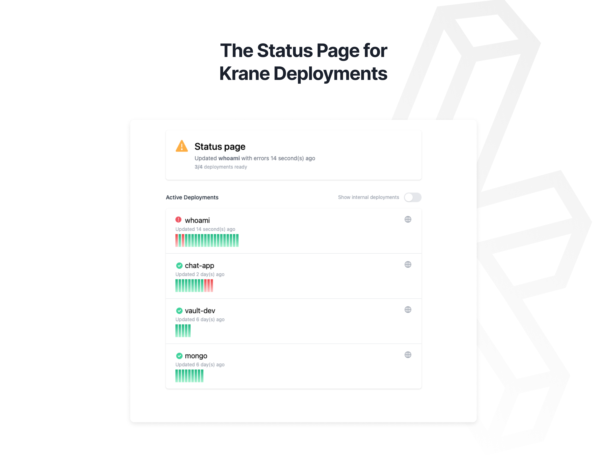

A web UI for monitoring [Krane](https://www.krane.sh/) deployments



## Installing

You can run the Krane UI and point it to any Krane instance using the below command

Official Docker Image: https://hub.docker.com/repository/docker/biensupernice/krane-ui

```
docker run -d --name krane-ui \
    -e KRANE_ENDPOINT=http://example.com \
    -e KRANE_TOKEN=changeme \
    -p 3000:3000 biensupernice/krane-ui
```

## Deploying

You can deploy the Krane UI using Krane since its packaged up into a docker image.

An example [deployment configuration](https://www.krane.sh/#/docs/deployment) can be seen below

`deployment.json`

```json
{
  "name": "krane-ui",
  "image": "biensupernice/krane-ui",
  "secure": true,
  "alias": ["status.example.com"],
  "secrets": {
    "KRANE_ENDPOINT": "@KRANE_ENDPOINT",
    "KRANE_TOKEN": "@KRANE_TOKEN"
  }
}
```

## Contributing

The Krane UI is written in Typescript using [next.js](https://nextjs.org/).

The [`@krane/common`](https://github.com/krane/common) library is used to interface with the Krane API.

This project is an open-source initiative, contributions and enhancement proposals are welcomed and appreciated.
