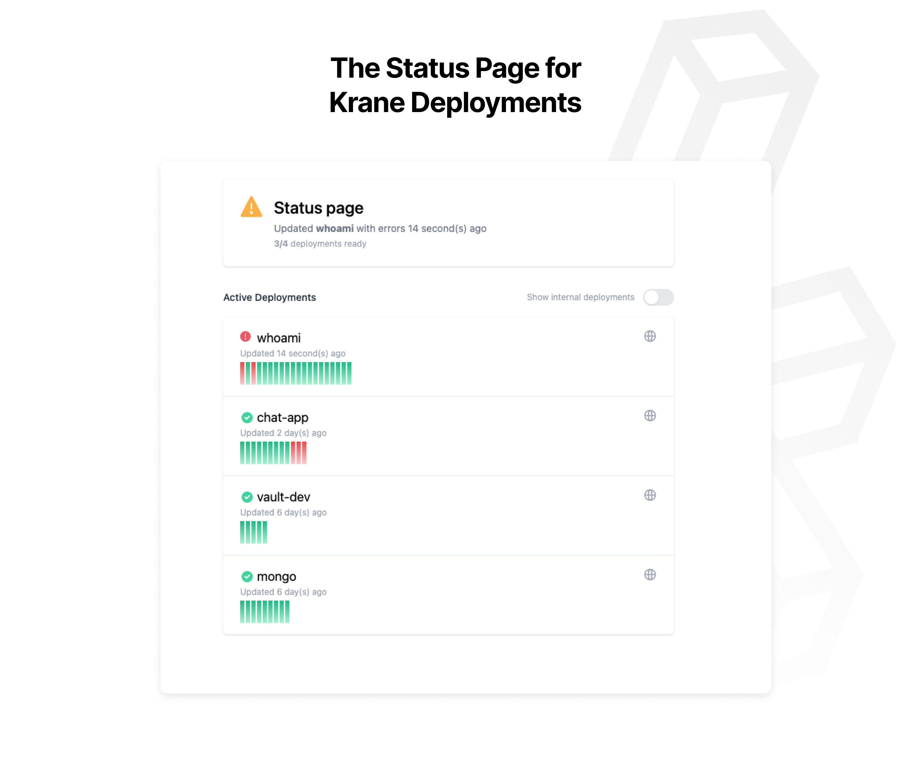

> The status page for [Krane](https://docs.krane.sh) deployments



## Installing

You can run the Krane status page pointing to any Krane instance using the below command

```
docker run -d --name krane-statupage \
    -e KRANE_ENDPOINT=https://krane.example.com \
    -e KRANE_TOKEN=changeme \
    -p 3000:3000 ghcr.io/krane/statuspage
```

## Deploying

You can deploy the Krane status page using Krane since its packaged up into a Docker image.

An example [deployment configuration](https://docs.krane.sh/#/docs/deployment) is shown below

`deployment.json`

```json
{
  "name": "krane-statuspage",
  "image": "krane/statuspage",
  "secure": true,
  "alias": ["status.example.com"],
  "registry": {
    "url": "ghcr.io"
  },
  "secrets": {
    "KRANE_ENDPOINT": "https://krane.example.com",
    "KRANE_TOKEN": "@KRANE_TOKEN"
  }
}
```

## Contributing

The Krane status page is written in Typescript using [next.js](https://nextjs.org/).

The [`@krane/common`](https://github.com/krane/common) library is used to interface with the Krane API.

This project is an open-source initiative, contributions and enhancement proposals are welcomed and appreciated.
